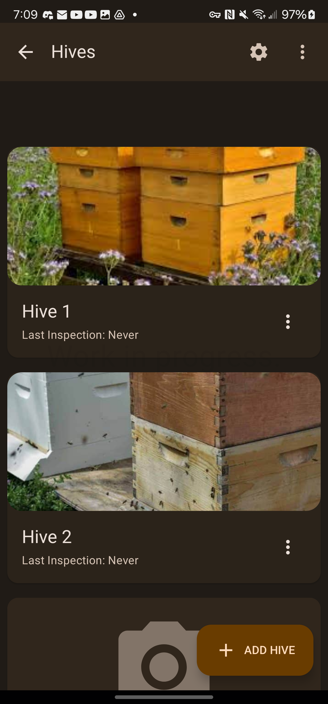
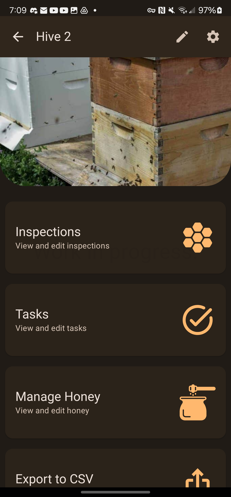
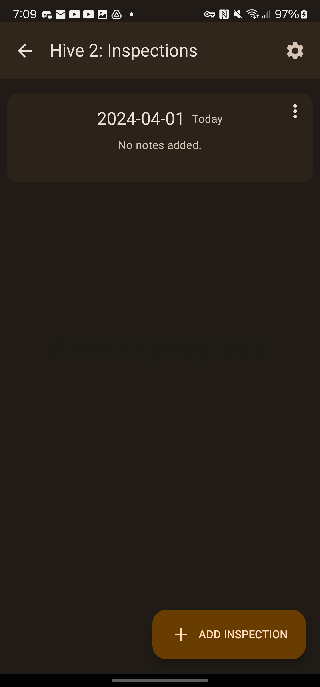
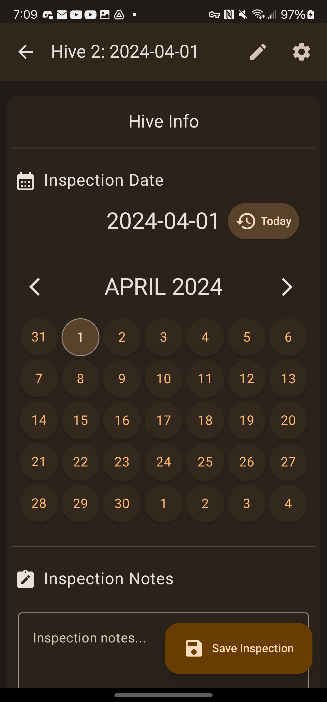
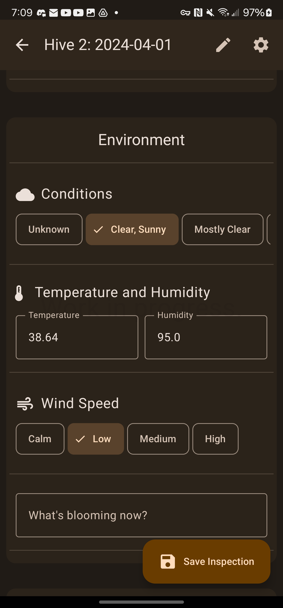

# BeeJournal

BeeJournal is an in-development Android application designed for beekeepers to create and manage beekeeping logs. Stay tuned for updates as we continue to work on enhancing the app!

## Features
- **User-friendly Interfaces:** Designed with Google's Material Design standards for intuitive user interaction.
- **Full-Stack Development:** Utilized Kotlin for Android development, along with Hilt for dependency injection, and Clean Architecture for maintainable code.
- **Hive Data Logging and Exporting:** Implemented features for logging hive data and exporting logs in CSV format for compatibility with master beekeeping programs.
- **User Feedback Integration:** Actively incorporated user feedback into the design and implementation of features.
- **Automated Testing:** Used JUnit and Espresso for UI testing, with GitHub Actions for automated CI/CD to increase Mean Time to Recovery (MTTR).
- **Ongoing Development:** Currently managing the app's production and updates to continually enhance its functionality and meet user needs.
- **Ad Integration:** Implemented ad integration using Google AdMob.

## Development Photos

    

        
    

    

        
    

    

        
    

    

        
    

    

        
    

## Getting Started
- Clone the repository: `git clone https://github.com/sloanmobile/BeekeepingApp.git`
- Open the project in Android Studio
- Build and run the app on your device or emulator

## License
This project is currently not licensed. You are free to view and fork the code, but please note that without a license, you do not have permission to use, modify, or distribute the code for any other purpose.